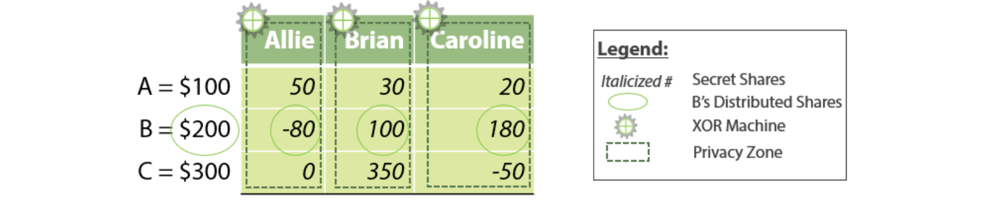
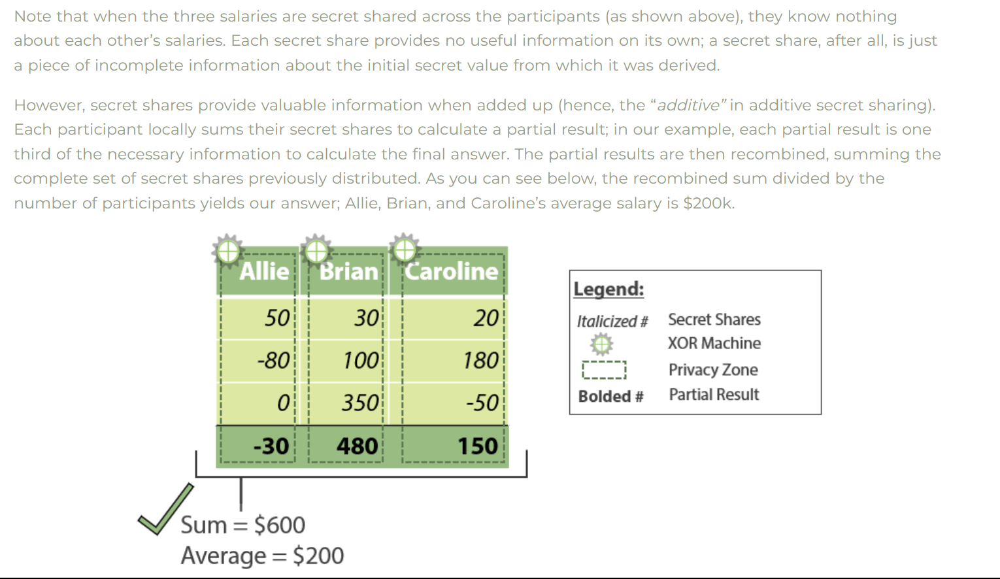

# Secure File Storage on Cloud using hybrid cryptography & multiparty Method

1. `cloud service` - [Google Cloud](https://chat.openai.com/share/a350d15e-28c1-4e20-b82e-7c73cbffef0f), [Overview](https://www.geeksforgeeks.org/an-overview-of-cloud-cryptography/), [Links](https://cloud.google.com/docs/)

2. `Log In Page` - [IP Based Login](https://connect.ebsco.com/s/article/What-is-IP-Address-Authentication?language=en_US), [IP_based_GitHub](https://github.com/topics/java-login-page) , [Role Based Access Control](<https://auth0.com/docs/manage-users/access-control/rbac#:~:text=Role%2Dbased%20access%20control%20(RBAC,assigning%20permissions%20to%20users%20individually.)>), [Role_Base_Github](https://github.com/topics/role-based-access-control?l=java)

3. `DashBoard` - Uploaded file names , Upload button, File Request button

4. `Algorithm encryption/Decryption` - AES, DES, RC6, SHA5
   [Algorrithm Explanation](https://chat.openai.com/share/d4c200ff-e7d9-451e-aa48-9c005a703ec9)

5. `Multiparty Method` -

### The Three Most Common Types of Homomorphic Encryption

Encrypted data can be stored safely or transferred to a third party for analysis. Depending on the type of homomorphic encryption, certain processes are possible.

##### `Partial homomorphic encryption`: This method of encryption can perform one type of operation on encrypted data. For example, this type of encryption would allow data to be either added or multiplied, not both. The obvious drawback is that only one type of operation is possible.

##### `Somewhat homomorphic encryption`: This method of encryption can perform more than one type of operation. Data encrypted this way could be added and multiplied, but there is a limit to the number of operations that can be accomplished.

##### `Fully homomorphic encryption`: With this method of encryption, more than one type of secure computation can be performed. Additionally, there is no limit to the number of operations that can be performed.

#### An Example Of Multiparty Encryption





6. `File Transfer Service Method` - [Email Attachments, Cloud Storage & Share Service](https://cloud.google.com/appengine/docs/legacy/standard/java/mail/mail-with-headers-attachments), [Explanation](https://ieeexplore.ieee.org/iel7/6287639/8948470/09262897.pdf)

7. `Code Language` - Java

8. `How To Run This Code` -

   ##### Step 1 -

   add Google Cloud dependencies in your pom.xml & sync pom.xml (if dependencies already sync then no need to do step 1 , you can direcly go on step-2)

   ```xml
   <dependencyManagement>
   <dependencies>
   <dependency>
   <groupId>com.google.cloud</groupId>
   <artifactId>libraries-bom</artifactId>
   <version>26.30.0</version>
   <type>pom</type>
   <scope>import</scope>
   </dependency>
   </dependencies>
   </dependencyManagement>
   ```

   ```xml
     <dependencies>
       <dependency>
         <groupId>com.google.cloud</groupId>
         <artifactId>google-cloud-storage</artifactId>
       </dependency>
     </dependencies>
   ```

   ##### Step 2 -

   run this command

   ```java
   cd src\main\java\com\securefile
   ```

   ```java
   javac *.java
   ```

   ```java
   java Main
   ```
